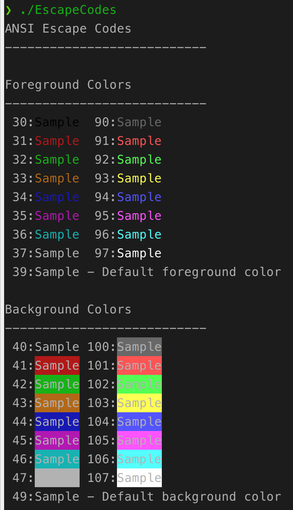

# Escape Codes
ANSI escape codes reference, see [wikipedia](https://en.wikipedia.org/wiki/ANSI_escape_code).  

Prerequisite: build-essential(g++/clang) and qt-core

Compile:
```shell
mkdir build; cd build; qmake ..; make
```

Usage: just run the program `EscapeCode`

Screenshot:  

